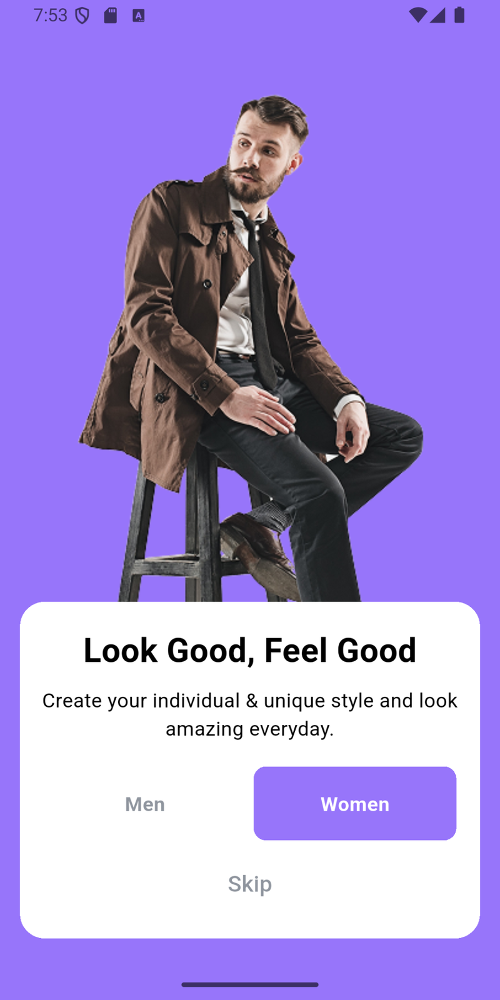
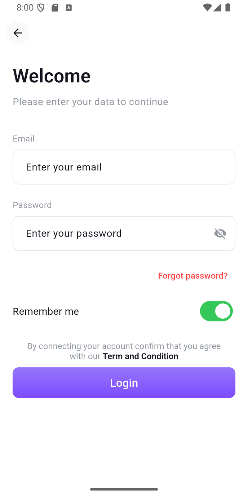
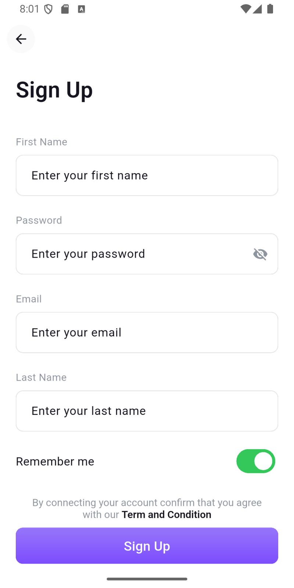
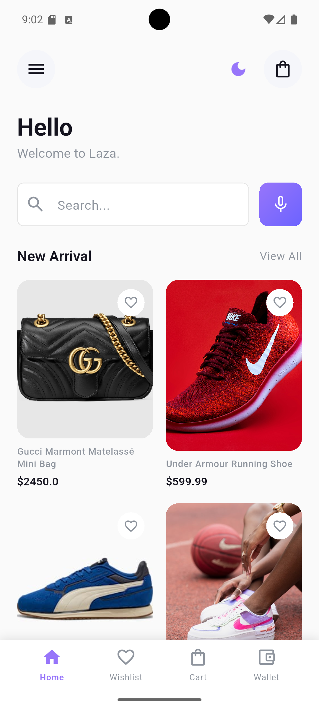
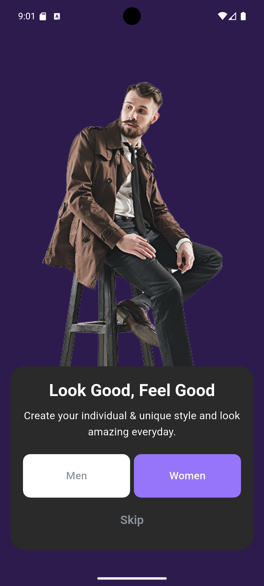
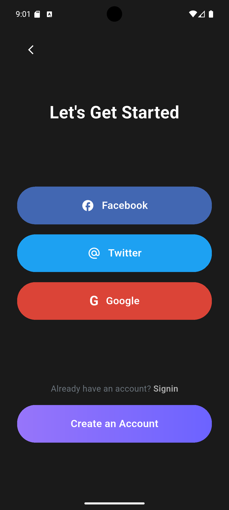
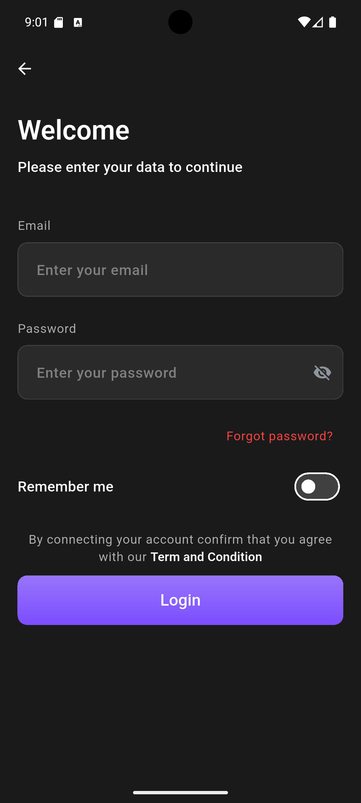
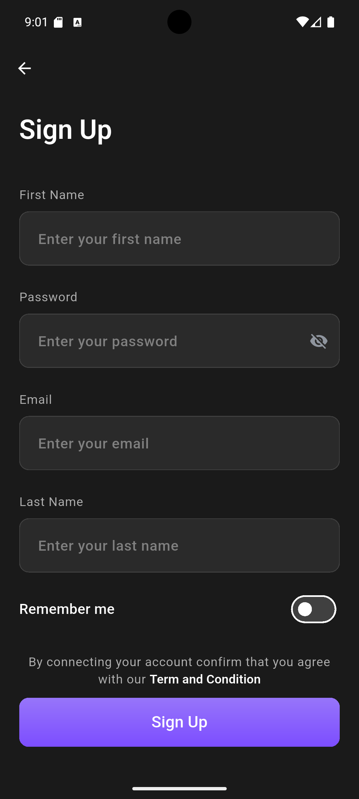
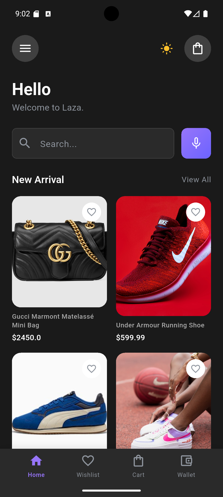

<div align="center">

# 🛍️ E-Commerce App

_A modern, feature-rich shopping experience built with Flutter._

[](https://flutter.dev)
[](https://dart.dev)
[](LICENSE)

**Clean Architecture • Modern UI • High Performance**

[Features](#-features) · [Screenshots](#-screenshots) · [Architecture](#-architecture) · [Getting Started](#-getting-started) · [Tech Stack](#-tech-stack) · [Project Structure](#-project-structure) · [Roadmap](#-roadmap) · [Contributing](#-contributing) · [License](#-license)

</div>

---

## 📱 Screenshots

<div align="center">

<table>
  <tr>
    <td align="center">
      <br />
      <b>Onboarding</b>
    </td>
    <td align="center">
      <br />
      <b>Welcome</b>
    </td>
    <td align="center">
      <br />
      <b>Login</b>
    </td>
    <td align="center">
      <br />
      <b>Register</b>
    </td>
    <td align="center">
      <br />
      <b>Products</b>
    </td>
  </tr>
</table>
<table>
  <tr>
    <td align="center">
      <br />
      <b>Onboarding (Dark)</b>
    </td>
    <td align="center">
      <br />
      <b>Welcome (Dark)</b>
    </td>
    <td align="center">
      <br />
      <b>Login (Dark)</b>
    </td>
    <td align="center">
      <br />
      <b>Register (Dark)</b>
    </td>
    <td align="center">
      <br />
      <b>Products (Dark)</b>
    </td>
  </tr>
</table>

</div>

---

## 🌟 Features

### 🔐 Authentication & Security

- ✅ **Secure Login/Registration** with JWT token management
- ✅ **Local Session Management** with SharedPreferences
- ✅ **Form Validation** with real-time feedback
- ✅ **Password Strength Indicator** for better security
- ✅ **Auto navigation** based on auth status
- 🔜 Social Login (Google, Facebook, Twitter)
- 🔜 Password Recovery

### 🎯 Onboarding Experience

- ✅ **Gender Selection** for personalized recommendations
- ✅ **Skip Option** for quick access
- ✅ **Smooth Animations** and transitions
- ✅ **Welcome Screen** with social login options

### 🛒 Shopping Features

- ✅ **Product Grid Display** with beautiful cards
- ✅ **Product Images** with caching
- ✅ **Favorites** functionality
- ✅ **Search Interface** (UI ready)
- ✅ **Bottom Navigation** for easy access
- 🔜 Product Details page
- 🔜 Shopping Cart
- 🔜 Checkout Process
- 🔜 Order History

### 🎨 UI/UX Excellence

- ✅ **Responsive Design** with ScreenUtil
- ✅ **Modern Purple Theme** `#9775FA`
- ✅ **Dark Mode Support** with theme toggle and persistence
- ✅ **Custom Widgets** for consistency
- ✅ **Smooth Animations** throughout the app
- ✅ **Native Splash Screen** with dark mode support
- ✅ **Clean and intuitive** navigation

---

## 🏗️ Architecture

This project follows **Clean Architecture** with a clear separation of concerns:

- **Presentation**: Flutter UI + `flutter_bloc` for state management.
- **Domain**: Use cases, entities, repository interfaces.
- **Data**: Repositories implementations, data sources, API clients, and local storage.

> Benefits: testability, scalability, and easier maintenance as features grow.

---

## 🧰 Tech Stack

- **Framework**: Flutter `3.8.1+`
- **Language**: Dart `3.8.1+`
- **State Management**: `flutter_bloc`
- **Networking**: (e.g., `dio` or `http`) — _specify actual package used_
- **Local Storage**: `shared_preferences`
- **Navigation**: `go_router`
- **Responsive UI**: `flutter_screenutil`
- **Image Caching**: (e.g., `cached_network_image`) — _specify if used_

> Tip: list the exact package versions in `pubspec.yaml` or add a **Dependencies** table here.

---

## 🚀 Getting Started

### Prerequisites

- Flutter `>= 3.8.1` and Dart `>= 3.8.1` installed
- Android Studio / Xcode with device/simulator
- (Optional) Backend API & JWT token endpoints

### Setup

```bash
# 1) Get packages
flutter pub get

# 2) Generate code (if any)
# flutter pub run build_runner build --delete-conflicting-outputs

# 3) Run the app
flutter run
```

### Environment / Config (Optional)

Create a `.env` or config file if you externalize endpoints:

```env
API_BASE_URL=https://your.api
TOKEN_HEADER=Authorization
```

---

## 📂 Project Structure

```
lib/
  core/                 # constants, helpers, theming
  features/
    auth/               # login, register, session
      data/
      domain/
      presentation/
    products/           # catalog, favorites
      data/
      domain/
      presentation/
  shared/               # common widgets, mixins, utils
```

> Keep features modular. Each feature mirrors **data/domain/presentation**.

---

## 🧪 Testing (Suggestions)

- Unit tests for **use cases** and **bloc**.
- Widget tests for critical screens (login, catalog).
- Golden tests for stable UI.

---

## 🗺️ Roadmap

- [ ] Product details page
- [ ] Cart & checkout
- [ ] Orders (history, tracking)
- [ ] Social login
- [ ] Localization (AR/EN)
- [x] Dark mode with theme toggle
- [ ] CI (format, analyze, test) via GitHub Actions

---

## 🤝 Contributing

1. Fork the repo
2. Create a feature branch: `git checkout -b feat/awesome`
3. Commit changes: `git commit -m "feat: add awesome"`
4. Push and open a PR

---

## 📄 License

> 📝 **Copyright © 2025 Abdelrhman Zakaria**  
> This project is licensed under the **MIT License** — see the [LICENSE](LICENSE) file for details.
